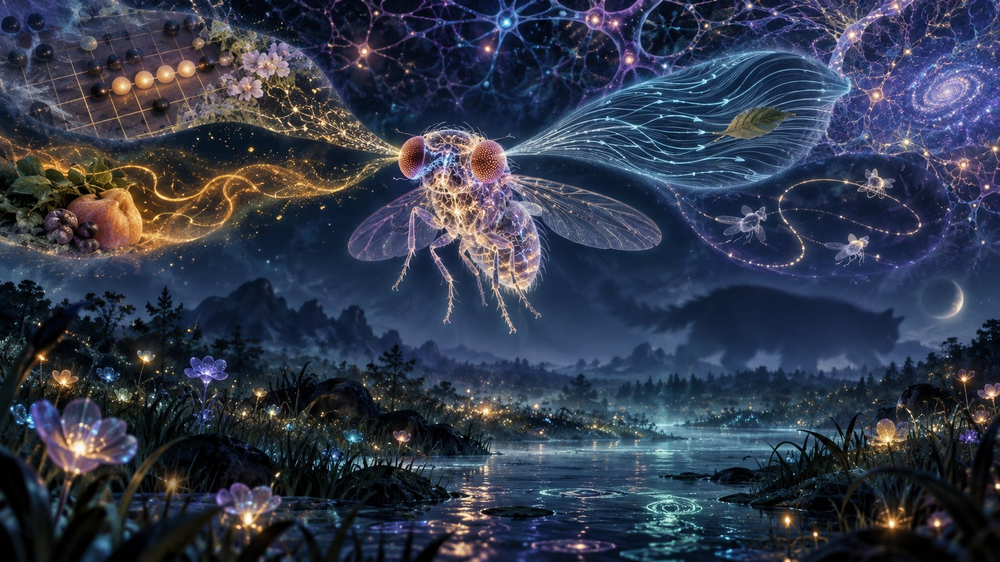
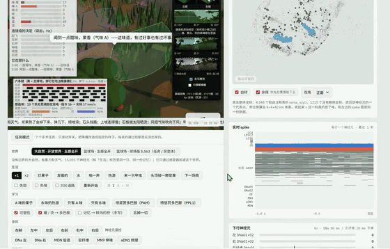

# flywire-fly-lab

[中文](README.md) · **English**

<p align="center"><a href="https://suifei.github.io/flywire-fly-lab/game.html"></a></p>

> **Start with [`REPRODUCTION.md`](REPRODUCTION.md)** (Chinese): every claim of each paper we checked, what we got, and what we could not do.
> The full lab notebook is [`docs/log/report.md`](docs/log/report.md) (Chinese).

**Running the whole *Drosophila* brain connectome on a 16 GB laptop, wiring it to a body, shipping it as a browser game — and doing 24,250 virtual surgeries on it.**
It documents what works, **what does not**, and every mistake the author caught in their own work.

[**▶ Play online (15,055 real neurons firing in your browser, living in a 3D landscape)**](https://suifei.github.io/flywire-fly-lab/game.html) · [**▶ Ecobox**](https://suifei.github.io/flywire-fly-lab/ecobox.html) · [**Full report**](docs/log/report.md) · [**Data license ⚠**](DATA_LICENSE.md)

> The code, the lab notebook and the in-game text are in Chinese. This English README is generated by `scripts/render_readme.py` from the same result files as the Chinese one, so the numbers match. Issues in English are welcome.

## 🎬 Videos

<a href="https://github.com/suifei/flywire-fly-lab/blob/main/media/nature_open_world.mp4"></a>

| | | | |
|---|---|---|---|
| [**▶ Open-world nature**](https://github.com/suifei/flywire-fly-lab/blob/main/media/nature_open_world.mp4)<br><sub>A 3D world with gravity and weather and no edges, inhabited by the 15,055-neuron fly</sub> | [**▶ All five senses**](https://github.com/suifei/flywire-fly-lab/blob/main/media/five_senses.mp4)<br><sub>Vision, hearing, smell, taste, touch, temperature, humidity; mushroom-body learning, dopamine, six legs</sub> | [**▶ Gomoku against a fly brain**](https://github.com/suifei/flywire-fly-lab/blob/main/media/gomoku.mp4)<br><sub>Line patterns → fly brain → one linear readout; its thinking drawn on the board</sub> | [**▶ Brain + physics body**](https://github.com/suifei/flywire-fly-lab/blob/main/media/embodied_physics_body.mp4)<br><sub>The same brain drives NeuroMechFly (MuJoCo): stops to eat at fruit, turns away from a warm "odor B" source by itself</sub> |

---

## What this is

In 2024 FlyWire published the complete connectome of the adult fruit-fly brain; Shiu, Sterne et al. built a whole-brain leaky integrate-and-fire (LIF) model on top of it; Eon Systems open-sourced that model.

This repository is **a complete reproduction plus extensions**, all done on one 16 GB M1 Pro MacBook:

| | |
|---|---|
| Model size | 138,639 neurons, 15,091,983 weighted connections, dt = 0.1 ms |
| One second of brain time | 2.5 s wall-clock (Brian2, 1 s sugar stimulus) |
| Virtual knockout screen | **24,250 whole-brain segments**, 14.68 machine-hours, three sensory pathways |
| Sub-circuits in the browser | Court version 5,563 neurons / 432,437 connections; life & nature 15,055 / 814,649 (incl. mushroom body) |

## Key findings

**1. "Is the model accurate?" is the wrong question — its reliability is local.**
Same parameters, same decision threshold, three pathways; agreement with the paper (Cohen's κ, chance-corrected, all three normalized to the null median) differs a lot:

| Pathway | κ | vs real optogenetic experiments |
|---|---|---|
| Sugar taste → proboscis extension | 0.59 | 6 / 10 |
| Water taste → proboscis extension | **0.87** | **9 / 10** |
| Antennal mechanosensation → grooming | **0.91** | 1 / 1 (testable) |

**2. Redundancy cannot be predicted from the wiring diagram.**
The pre-registered hypothesis was "backup = disjoint paths to the output". Measured correlation: **-0.008 (sugar) / +0.013 (water)** — not weak, zero, with metric degeneracy ruled out. **To know whether two neurons back each other up, you have to knock both out and run it.**

**3. One behaviour, two circuits.**
Sugar and water both trigger proboscis extension through the same motor neuron MN9, but their active neurons overlap by only a third and their hubs are private: `CB0883` never fires in the water pathway, and knocking out `CB0051` does nothing in the sugar pathway. Knocking out the inhibitory neuron `Phantom` **multiplies water-pathway output by 3.0** (whole brain, null-median normalized).

**4. Our own pre-registered "concentration → predictability" hypothesis was refuted by our data.**
The JON pathway is the most concentrated (Gini 0.922) yet the **least** predictable from wiring alone (G3 0.288 < sugar's 0.316). See [docs/log/report.md §22.2](docs/log/report.md).

**5. It can learn Gomoku — but give credit where it is due.**
A fly brain (not a single synapse trained) plus one linear readout learns to value every line on a Gomoku board: all 14,641 line patterns are run through the brain. The ordering it discovers by itself (five > open four > four, open three > …) is entirely correct, and its first choice agrees with a depth-8 search **49.5%** of the time (random 1.5%, no brain 34.8%).
Given to a rules-only search, it beats the hand-written teacher **31–9** (6-ply vs 4-ply) and **13–7** (10-ply vs 8-ply).
**But** a shuffled connectome (48.8%) and a random network of the same size (51.1%) do no worse; head to head 23–16–1 —
**the real connectome contributes nothing special to Gomoku**; the look-ahead is done by the search, not the fly. See [docs/log/report.md §46](docs/log/report.md).

## Gomoku: playing against a fly brain

The game page ([Digital Fly Lab](https://suifei.github.io/flywire-fly-lab/game.html)) has a **Gomoku** tab: a 15×15 board, and the live spike / descending-neuron / sensory panels show **the fly that is playing**.

- Three match types: **you vs the fly** (you play black, with renju forbidden moves), **fly vs fly** (each side has its own 5,563-neuron brain), **fly vs teacher**.
- **Reasoning depth** (1–6, 8) can be switched at any time. Each depth is a **trained readout** whose labels were "the best move found by an N-ply search"; **no search runs while playing**, only model inference.
- **Its thinking is drawn on the board**: orange circles = the model's probability for each candidate; numbered ghost stones = the continuation it expects.
- **Real-brain check**: each move's line patterns are re-run through the real fly brain and compared with the trained value table.
- **External search** (off by default): hands the fly's value table to an alpha-beta search. **That is an algorithm, not the fly**, and the page says so.

How it plays: for a candidate point, take one line in each of 4 directions (4 cells on each side; each cell empty / mine / theirs / edge). There are only 14,641 such patterns, few enough to **run every one through the brain**: 8 cells × 3 states = 24 channels, each wired to about 61 real sensory neurons, Poisson-driven for 300 ms; downstream spikes are counted (4 input assignments × 3 random seeds, averaged). A move's score = 4 attacking lines + λ × 4 defending lines.

| | |
|---|---|
| First choice agrees with depth-8 search | **49.5%** (random 1.5%, no brain 34.8%) |
| External test set (25,146 positions from the Wine engine, never trained on) | 47.0% |
| Unseen Poisson seeds | drops only 3.5 percentage points |
| External search, 6-ply vs teacher at 4 / 6 / 8 ply | 31–9 / 19–21 / 6–14 |
| External search, 10-ply vs teacher at 8 ply | 13–7 |

| Reasoning depth (which readout) | Agrees with depth-8 search | vs random | vs old teacher | vs teacher (1-ply) | vs teacher (2-ply) |
|---|---|---|---|---|---|
| 1 | 46.6% | 40–0 | 65–70–65 | 74–88–38 | 35–65 |
| 2 | 44.7% | 40–0 | 49–118–33 | 70–117–13 | 27–72–1 |
| 3 | 46.3% | 40–0 | 64–98–38 | 65–110–25 | 34–64–2 |
| 4 | 48.1% | 40–0 | 64–100–36 | 73–109–18 | 31–69 |
| 5 | 47.5% | 40–0 | 85–81–34 | 67–99–34 | 31–68–1 |
| 6 | 48.5% | 40–0 | 65–94–41 | 87–94–19 | 30–69–1 |
| 8 | 49.5% | 40–0 | 72–88–40 | 64–108–28 | 33–67 |

Pre-registered criterion "model trained on depth-8 labels beats model trained on depth-1 labels, ≥ 55% over 200 games" → **does not hold** (36.0%).

Equally important: (1) **the real connectome contributes nothing special** (shuffled 48.8%, random network 51.1%); (2) **self-play reinforcement ("dopamine"-style three-factor rule) is a negative result**: 6–194 against the pre-reinforcement table, and the reward-prediction error is computed outside the connectome; (3) **every number of Gomoku v1 is void**: stimuli were not cleared between inputs (pattern A alone = 252 spikes, A after B = 1,901). Details: [§46](docs/log/report.md).

## Life mode: the five senses go to real receptors; the connectome does the rest

A single fly (sub-circuit v4: 6,296 neurons, adding **hearing**, two **olfactory glomeruli** and 4 **interoceptive neurons**) lives in an open world where day and night, fruit, puddles, odours, buzzing, heat, wind, dust and incoming balls just happen. Each one reaches the fly **only as a physical quantity at its real receptors** — **there is no "smell it, go there" or "hear it, run" rule.**

| | Measured |
|---|---|
| **Hearing** | Reaches the giant fibre in one hop. Sound alone never triggers takeoff, but it advances the looming response: takeoff lead **435 → 825 ms**, dodges 24 → 38 / 100; deafened, back to 425 ms |
| **Smell** | **Negative**: reaches no motor readout; sugar contacts in 10 min, intact 7.667, anosmic 8.667 |
| **Interoceptive ISN** | **Negative, and opposite to the literature**: driving it lowers MN9 while eating sugar from 44.1 to 2.5 Hz (it promotes feeding in real flies). It signals via a neuropeptide the LIF model lacks; off by default, sign not flipped to fit |
| **Body state** | Only modulates taste-receptor gain: starts eating on sugar contact 100% of the time when starved, 32% when sated — and an unprogrammed **satiety** emerges |
| **Walls** | **Negative**: touch alone cannot avoid walls — 270 mm travelled in 3 min in a rectangle (stuck in a corner), 93% of the time on the wall of a round arena; hence this world has no walls |

Details: [§47](docs/log/report.md).

## Ecobox: you design the world; it learns and evolves by itself

**[Open the Ecobox →](https://suifei.github.io/flywire-fly-lab/ecobox.html)** ([docs/ecobox.html](docs/ecobox.html), a single offline-capable file)

An unattended round terrarium: food that rots, puddles that dry up, day and night, wind, rain, beetles. You **give the fly no task** and **cannot change its reward** — the reward is only that its body's six internal states (hunger, thirst, stamina, health, scent, body temperature) got closer to comfortable. All you can change is the world.

| Layer | What it is | Who can change it |
|---|---|---|
| World rules | food, water, temperature, wind and rain, beetles, terrain | you |
| Genes (10 numbers) | learning rate, exploration, flight tendency, preferred temperature, metabolism, caution, four innate biases | evolution |
| Plastic layer | adjustable weights beside the brain that bias its innate reflexes | this fly's lifetime; **not inherited** |
| Connectome | 15,055 neurons; escape, proboscis extension, steering and backing-up are built-in reflexes | **nobody** |

- **Single-fly learning**: after 30 consecutive lives, learning is frozen and the fly is tested in unseen worlds — no learning 425 s, learned ≥ 1800 s (× 4.231, censored); a time-shuffled-reward control does not improve; 9 of 10 other individuals learn; **a long-term training task with 10 fresh individuals: 10/10 learn, 10/10 on a re-test in new worlds** (`node eco/train_long.js`, 210 lives).
  What it learns: "stop and drink when you touch water" (in the connectome, water taste drives the proboscis motor neuron MN9 to only 13 Hz in the real brain — not enough innately) and "turn less while humidity is rising". It does **not** learn to find water from a distance: 422 s vs 417 s in a drought world.
- **Evolution with 32 flies**: no fitness function — only well-fed, well-watered flies accumulate eggs. Beetle swarm: lifespan 408 → 926 s, flight tendency falls; Calm: lifespan 451 → 930 s, flight tendency flat; Sparse: lifespan 406 → 481 s, flight tendency flat. Pre-registered criterion (different worlds push flight tendency in different directions) passes. Flight is a **decision**, not a controlled skill: whether to take off is up to the fly, the flight itself is a fixed trajectory — flight control is not wired into the connectome, and we do not pretend it can learn to fly.
- **Discovery cards**: lying flat, hugging the glass, spinning in place, camping on food… reward hacking and failures are detected with evidence. You choose: accept its current way of life, or change the world to force another.
- **A save is a training result**: world rules + generation timeline + every fly's weights + cards + replays. Resuming is bit-identical to never stopping; a 167-character challenge code lets someone else start in the same world.
- The page runs a **response surface** of the real brain (the real brain runs at only 1.18× real time per fly), fitted on 7,200 real-brain samples plus 11,339 closed-loop samples (real-brain index 86.6). Put back into the real brain, a trained fly survives 900 s vs 422 s for a naive one; drinking time in the real brain is 1.49× the surface's, and the pre-registered "same behavioural magnitude" criterion (0.5–2×) passes.
- **Moved into the 3D landscape**: the training conditions were first aligned with the landscape (same sensory encoding; closed-loop samples in the surface), then a trained fly with frozen weights was put into the lab page's landscape with the real brain: over 5 informative seeds it drinks longer in 5/5 and is less thirsty in 5/5; pre-registered criterion passes. In the lab page's life mode, the landscape has a **Load ecobox save** button.

Honestly: not one synapse of the connectome changes; learning happens in a hand-written plastic layer, and a control that cannot see the brain's outputs learns just as well — in this task the connectome supplies the body and its reflexes, not the learning signal. Plan, audit and all measurements: [docs/ecobox/](docs/ecobox/), report [§50](docs/log/report.md).

## Nature: a 3D world with gravity, weather and no edges

The game page now opens in a **nature** world (the "world" switch still goes back to the basketball court): seeded, endless rolling terrain with rocks, dark slabs, mushrooms, flowers, grass, berry bushes and puddles; day and night, wind and rain.
Physics uses real units: gravity 9,810 mm/s² — ripe berries fall from the branch (30 mm in 0.08 s; analytic 0.0782 s), bounce off the terrain normal, roll downhill and ferment when they stop; rocks are solid; uphill is slower; the sun heats the slabs; hollows fill with rain and evaporate; wind carries odour downwind.
The inhabitant is the 15,055-neuron fly, and **it knows the world only through real receptors**. No behavioural rule was added. All nine pre-registered physics checks pass (`node dodge/nature_test.js`); in 3 minutes it walks 2676 mm, is blocked for 26.0 s, sees 17.3 berries fall and touches sugar 1.0 times.
It plays like a sandbox (Minecraft-style tools, naturalistic look): place fruit, dig puddles, place rocks, plant mushrooms / bushes / flowers, add beetles, raise or lower terrain; `C` switches camera, `A` `D` `S` and space drive the real steering / backing / giant-fibre neurons, `F` fills the window.
Honestly: the default visual front end is still a hand-written looming detector — rocks and grass are not in its vision (the real-pixel path exists, off by default); the fly's own body is kinematic and cannot fall over. Details: [§49](docs/log/report.md).

## Learning, dopamine, closed loop, six legs

The life-mode fly uses sub-circuit v5: **15,055 neurons, 814,649 edges** = v4 plus the connectome's mushroom-body learning circuit (Kenyon cells 5,177, mushroom-body output neurons 96, dopaminergic neurons 331). All wiring is from FlyWire; the only thing that changes is the Kenyon-cell → MBON synapse, depressed when a Kenyon cell has just fired and dopamine arrives in the same compartment. Pre-registered criteria:

| Question | Result |
|---|---|
| Why does any odour make the whole brain run away? | **The sign of the antennal-lobe local neurons' transmitter.** Made inhibitory (as in the literature): active Kenyon cells 76% → 3.5%; **whole-brain check**: runaway 6/6 → 0/6 |
| Can sugar / bitter / heat / humidity recruit dopamine neurons through real wiring? | **Negative**: across 12 conditions, not a single dopamine neuron fires ≥ 5 Hz. So "sugar → PAM, heat → PPL1" is hand-wired (like optogenetic activation) |
| Does it learn? | **Yes, slightly unspecific**: the paired odour's response in the reinforced compartment drops to 0.00 of control; unpaired dopamine leaves it unchanged (0.99); PAM- and PPL1-depressed MBONs do not overlap (0.00); the unpaired odour also drops to 0.82 (criterion ≥ 0.85, fails) |
| Does the memory change behaviour? | **Negative**: none of the 6 groups of motor readouts changes significantly after training. The "memory → steering bridge" on the page is hand-written and off by default |
| Does the browser engine learn the same as Python? | Yes: remaining synaptic strength correlates r = 0.9999 |
| Can six legs push the body? | All four criteria pass: straight 18.3 mm/s (command 18), turning +61 / -61 °/s (command ±60). Leg rhythm and coordination are hand-written |
| Brain + physics body (NeuroMechFly, MuJoCo) | Reward memory holds (MBON response 0 vs 70 Hz); punishment memory **does not** — it walks up to the warm odour-B source and **turns away by itself**, burned for only 0.5 s; nobody wrote that U-turn |

Details: [§48](docs/log/report.md).

## What it cannot do (just as important)

| Goal | Actual result |
|---|---|
| Drive behaviour from photoreceptors (R1-6 / R7 / R8) | Descending neurons stay at **0 Hz**; visual input must enter at projection neurons such as LC4 |
| A reward signal from eating sugar | Across 12 sugar / bitter / heat / humidity conditions, **not a single** dopamine neuron fires ≥ 5 Hz. The mushroom-body reinforcement is hand-wired; the Ecobox reward is the body's own, computed outside the connectome |
| A walking rhythm from the ventral nerve cord | A rhythm, but no tripod gait; effectively one of six legs moves. The page's leg rhythm is hand-written |
| Turn toward an odour | Unilateral stimulation gives no left/right difference (whole brain, lateralization index -0.008 / -0.061). The old runaway is fixed (transmitter sign; 6/6 → 0/6), the missing lateralization is not |
| Memories that change behaviour | Memories **form** in the mushroom body but **do not reach** the motor outputs (none of 6 groups changes). The Ecobox fly survives thanks to a hand-written plastic layer beside the connectome, not the connectome itself |
| Closed-loop behaviour (brain + body) | Done, **but the behavioural mapping is hand-written** (DNa → steering, giant fibre → takeoff, MN9 → feeding thresholds and gains) |
| Dodge balls with its eyes alone | Done, and **a quantified negative**: real pixels → flyvis → LPLC2 reads exactly 0 beyond **45 mm** and separates the ball from noise only within 25 mm, while merely walking produces spurious looming of up to **126 Hz** ([§28.19](docs/log/report.md)) |

## Mistakes the author caught

[docs/log/report.md §23](docs/log/report.md) keeps an **error ledger** of every mistake found and fixed, never deleted. Three rounds of number-by-number checks against the result files found **48** problems (20 of them in the third round, which traced from the newest conclusions back to the oldest), among others: a compute ledger that went stale more than once (it was generated by an ad-hoc shell loop in the report text); the same ratio normalized on the page and un-normalized in the report with neither labelled; two cards on the game page reaching opposite conclusions about one pre-registered hypothesis; **every vision conclusion resting on 1 of flyvis's 50 pretrained models**; a simulator that compiled the random seed into the binary, so "4 runs" were 4 copies of one run; a "2/2 accuracy" that was a hand-typed string for a neuron never tested; and, in the Ecobox, a 4× closed-loop drinking gap between the real brain and its response surface that came from the time structure of the noise, not from the mean.

No error was found in numbers produced by scripts — **the errors were almost all in hand-written summaries and cross-references**. That is why the web page and both READMEs read their numbers from result files (`python3 scripts/render_readme.py --check` runs in CI).

## Quick start

```bash
# 1. Environments (several conda envs that cannot be merged; see setup.sh)
bash setup.sh cpu        # brain-fly-cpu: Brian2 + numpy 1.26
bash setup.sh flygym     # flygym: FlyGym 2.1 + torch

# 2. Upstream code (not redistributed here; see DATA_LICENSE.md §4)
git clone https://github.com/eonsystemspbc/fly-brain external/fly-brain

# 3. Smallest experiment: stimulate sugar taste neurons, watch the proboscis motor neuron MN9
conda activate brain-fly-cpu
python run_experiment.py --preset sugar --t_run 1
#   → 398 active neurons; MN9 left 98 Hz / right 69 Hz (official notebook's left/right naming); all other descending neurons 0

# 4. Open the game locally
python3 dodge/build.py && open results/dodge/fly_dodge.html
python3 eco/build.py && open docs/ecobox.html
```

Every script's docstring documents its usage and pre-registered criteria.

## Layout

| Path | Contents |
|---|---|
| `run_experiment.py` | Smallest experiment: activate / silence / record, Brian2 and PyTorch backends |
| `dodge/` | Sub-circuit extraction, real-time JS brain engine, game logic and page |
| `eco/` | Ecobox: world, body and intrinsic reward, plastic layer, response surface, evolution, saves, transfer to the 3D landscape |
| `screen/` | Virtual knockout screens (three pathways, double knockouts, hub scans, concentration analysis) |
| `vnc/` | Ventral nerve cord: BANC LIF, Pugliese rate model, full MANC, proprioceptive loop |
| `vision/` | Compound eye → flyvis → whole-brain connectome, offline |
| `gomoku/` | Gomoku: line patterns → fly brain → linear readout; search engine, teacher, data, training, regression tests |
| `learn/` | Mushroom-body learning: odour coding, reinforcement, conditioning, memory → motor, whole-brain checks, engine parity, physics-body loop |
| `language/` | "The fly speaks": a 12-word decoder and BCI stress tests |
| `flight/` | flybody flight-controller replay, real escape-flight trajectories |
| `docs/log/report.md` | **Full report** (Chinese), including every negative result and the error ledger |

## License

- **Code**: [GPL-3.0-or-later](LICENSE) (it imports Eon's GPL-2.0-or-later code).
- **Data under `results/`**: **not GPL**. It includes data derived from the FlyWire connectome and is **treated as CC BY-NC 4.0 — no commercial use**. See [**DATA_LICENSE.md**](DATA_LICENSE.md) before using it.
- Please cite the original papers, not just this repository; the list is in [DATA_LICENSE.md §3](DATA_LICENSE.md).

## In one sentence

> Having the complete wiring diagram of a brain and knowing how to drive it are two different things.
> This repository records how many walls I drove it into.
